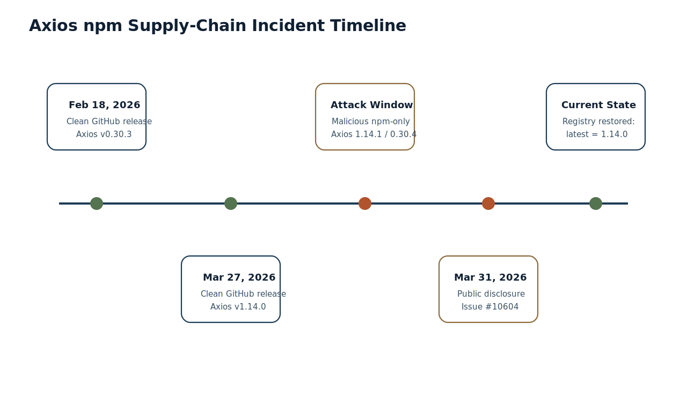
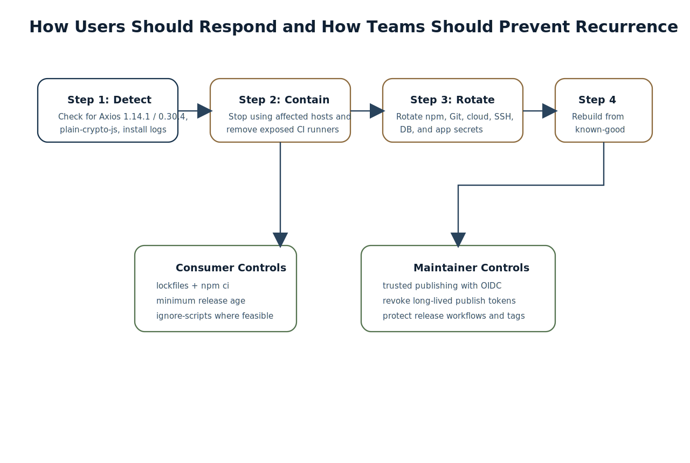

# Abstract

On March 31, 2026, the Axios maintainers and broader security community disclosed that two npm-published Axios versions, `1.14.1` and `0.30.4`, had been compromised. The public GitHub issue describing the event explicitly identified both versions as affected, while third-party incident analysis and maintainer-side discussion pointed to a hidden malicious dependency chain involving `plain-crypto-js` and a `postinstall`-triggered remote access trojan workflow. As of March 31, 2026, current registry state indicates that the npm package `axios` once again resolves to `1.14.0` as the latest published version, that `1.14.1` and `0.30.4` are no longer present in the public registry version list, and that `plain-crypto-js` has been replaced with a security placeholder version `0.0.1-security.0`.

This paper documents the incident in a structured format suitable for technical teams. It focuses on four questions: what happened, what users should assume if they installed the compromised releases, how to determine likely exposure, and what controls reduce the probability of similar supply-chain failures in the future. The analysis is based on primary and near-primary sources available on March 31, 2026, including the Axios GitHub issue thread, Axios GitHub releases, npm registry state, and official npm security and package-management documentation.

## 1. Incident Summary

The Axios incident was not a source-repository compromise in the ordinary sense of a malicious GitHub release being openly tagged in the public release stream. Instead, the observable evidence indicates an npm distribution compromise affecting versions that did not line up with the current legitimate GitHub release surface.

As of March 31, 2026:

| Item | Observed state |
| --- | --- |
| Public incident issue | Axios issue `#10604` |
| Issue title | `axios@1.14.1 and axios@0.30.4 are compromised` |
| Issue creation time | March 31, 2026 03:00:27 UTC |
| Latest clean public GitHub release on `v1.x` | `v1.14.0` published March 27, 2026 |
| Latest clean public GitHub release on `v0.x` | `v0.30.3` published February 18, 2026 |
| npm registry latest dist-tag for `axios` on March 31, 2026 | `1.14.0` |
| `axios` versions present in npm registry on March 31, 2026 | `1.14.1` absent, `0.30.4` absent |
| `plain-crypto-js` registry latest on March 31, 2026 | `0.0.1-security.0` |

This mismatch matters. It strongly suggests that the malicious versions were distributed through npm during an attack window and later removed, while the legitimate GitHub releases remained at earlier clean versions.

## 2. What Happened

The public Axios issue opened on March 31, 2026 explicitly stated that `axios@1.14.1` and `axios@0.30.4` were compromised. That issue linked directly to a StepSecurity incident write-up whose summary described the event as a hijacked maintainer-account incident in which malicious Axios releases were published to npm and a hidden dependency dropped a cross-platform remote access trojan.

The core public facts are:

- malicious Axios versions were published to npm
- those versions were `1.14.1` and `0.30.4`
- the malicious chain involved `plain-crypto-js`
- install-time execution was driven by a `postinstall` mechanism
- npm later removed the malicious versions and replaced the secondary malicious package with a security placeholder

Maintainer-side comments in the Axios issue also indicate that:

- npm tokens tied to the compromise were removed
- the compromised versions were removed from the npm registry
- the package page could briefly show stale results due to caching

## 3. Technical Mechanism

The strongest public description available on March 31, 2026 is that the compromised Axios releases introduced a hidden dependency that eventually resolved to malicious `plain-crypto-js` content. StepSecurity's incident summary described the result as a cross-platform RAT dropper. Community analysis inside the Axios issue further described a `postinstall`-driven execution path and noted that after installation, forensic inspection of `node_modules` might be misleading because the malicious package could overwrite or remove visible indicators after execution.

That has two important implications.

First, this was not a passive dependency typo or a simple malicious tarball sitting dormant in a tree. It was an active installation-time execution path.

Second, affected users cannot safely conclude that they were unaffected simply because the installed package directory no longer looks suspicious after the fact.

For practical risk analysis, the most defensible model is:

1. the user installed or updated into one of the malicious Axios versions during the attack window
2. npm resolved the hidden malicious dependency
3. install-time scripts executed
4. a system-level payload chain may have been dropped or fetched

## 4. Why This Incident Was Especially Dangerous

The Axios incident is notable for several reasons.

### 4.1 High-Trust Package

Axios is one of the most widely used HTTP client libraries in the JavaScript ecosystem. A compromise of a package at that level is materially different from compromise of an obscure package because accidental uptake is much more likely.

### 4.2 Normal Upgrade Path

The community discussion in the Axios issue showed exactly how ordinary semver behavior could move downstream projects onto `1.14.1`. Users reported transitive uptake through ranges such as `^1.6.5`, meaning teams that did not deliberately choose the malicious version could still land on it during normal install or refresh operations.

### 4.3 Install-Time Execution

The public technical discussion and incident reporting indicate that the attack relied on install-time code execution rather than only on malicious runtime behavior inside application requests. That is a much worse posture because the installation environment itself becomes part of the blast radius.

## 5. Current Registry State as of March 31, 2026

The current public state is important because many teams need to know whether the malicious versions are still available.

On March 31, 2026, npm registry metadata showed:

- `axios` latest dist-tag = `1.14.0`
- `axios` version list does not include `1.14.1`
- `axios` version list does not include `0.30.4`
- `plain-crypto-js` latest dist-tag = `0.0.1-security.0`
- `plain-crypto-js` no longer exposes the malicious version `4.2.1`

That means the immediate public registry state has been corrected. It does **not** mean users who installed during the attack window are automatically safe.

## 6. Exposure Assessment

The key exposure question is not only "what is on npm now?" It is "what did your systems install while the malicious versions were live?"

### 6.1 You Should Treat Yourself as Potentially Exposed If

- you installed `axios@1.14.1` directly
- you installed `axios@0.30.4` directly
- your lockfile captured either version
- your CI pipeline or developer machine ran `npm install`, `pnpm install`, or equivalent during the attack window and resolved one of those versions
- your lockfile or install metadata shows `plain-crypto-js`

### 6.2 Fast Triage Questions

| Question | Why it matters |
| --- | --- |
| Did any machine install `axios@1.14.1` or `0.30.4`? | Confirms primary exposure path |
| Did any lockfile contain `plain-crypto-js`? | Confirms the malicious chain was at least resolved |
| Were install scripts allowed to run? | Determines whether the dropper likely executed |
| Did CI or build agents install the package? | CI secrets and cloud credentials may have been exposed |
| Were developer laptops involved? | Local SSH keys, browser sessions, and cloud auth may have been exposed |

### 6.3 Operational Interpretation

If the malicious version was installed and install scripts executed, the safest assumption is that the machine was exposed to hostile code, not merely to a bad dependency record.

## 7. What Users Should Do If They Were Affected

The right response depends on whether the malicious code only resolved in metadata or actually executed on a host. For safety planning, teams should bias toward stronger containment rather than minimal cleanup.

### 7.1 Immediate Containment

1. Stop using the affected machine or CI runner for sensitive operations.
2. Identify where `axios@1.14.1`, `axios@0.30.4`, or `plain-crypto-js` appeared in lockfiles, caches, or install logs.
3. Remove affected nodes from service if they were part of a build or deployment path.

### 7.2 Credential Response

If an affected system ran install-time scripts, rotate credentials that may have been accessible on that host:

- npm tokens
- GitHub or GitLab tokens
- cloud credentials
- SSH private keys
- CI secrets
- `.env` secrets
- database credentials
- signing keys if they were present on the host

### 7.3 System Recovery

If malicious install-time execution is confirmed or highly likely, rebuilding from a known-good base image is safer than trying to "clean in place."

### 7.4 Dependency Cleanup

After containment:

- delete `node_modules`
- clear package-manager caches as appropriate
- remove malicious versions from lockfiles
- reinstall from a known-good dependency state
- verify `axios` resolves to safe versions such as the current clean registry state

## 8. Prevention Guidance for Consumers

No single control prevents all supply-chain incidents, but several practical controls materially reduce risk.

### 8.1 Commit Lockfiles and Prefer `npm ci`

The npm documentation for `npm ci` emphasizes that it installs from an existing lockfile, errors when `package.json` and the lockfile diverge, and removes existing `node_modules` before installation. In practice, this makes dependency resolution more deterministic than repeated unconstrained `npm install` in CI.

Recommendation:

- commit lockfiles
- use `npm ci` in CI and production builds
- avoid casual dependency refreshes in sensitive pipelines

### 8.2 Add a Release Cooldown

The npm docs now document `min-release-age`, which delays adoption of very fresh package releases. In incidents like Axios, this can prevent immediate uptake of a poisoned version before the ecosystem has time to detect and respond.

Recommendation:

- set a non-zero `min-release-age` for automated environments
- reserve same-day adoption for intentionally reviewed dependency changes

### 8.3 Disable Install Scripts Where Feasible

The npm config documentation for `ignore-scripts` states that npm will not run scripts declared in `package.json` when this option is enabled, except for explicitly invoked script commands. Because this Axios incident appears to have relied on install-time script execution, disabling scripts in environments that do not require them is a meaningful defense.

Recommendation:

- use `ignore-scripts=true` in hardened CI or verification environments where dependency install scripts are unnecessary
- separate script-enabled build steps from script-disabled audit or policy steps

### 8.4 Use Security Scanning and Registry Policy

Automated software composition analysis and package-policy tools will not stop every first-wave incident, but they help narrow exposure windows and provide faster detection.

Recommendation:

- scan lockfiles in CI
- alert on unexpected new transitive packages
- monitor for packages removed from registry or replaced with security stubs

## 9. Prevention Guidance for Maintainers and Publishers

Consumer defenses are only half of the picture. Publisher-side controls matter just as much.

### 9.1 Trusted Publishing

npm's trusted publishing documentation recommends OIDC-based trusted publishers to eliminate long-lived automation tokens from the release path. This is relevant here because public Axios issue discussion explicitly questioned token use and trusted-publishing posture in the affected publishing workflow.

Recommendation:

- configure trusted publishing for supported CI workflows
- revoke legacy automation tokens where possible
- combine trusted publishing with provenance

### 9.2 Protect Release Workflows

High-impact packages should treat tag creation, publish workflows, and environment approvals as security boundaries.

Recommendation:

- require strict review for publish workflows
- protect tags and release branches
- minimize who can publish
- audit automation changes continuously

### 9.3 Reduce Silent Package Risk

Maintainers should treat any new transitive dependency in a high-trust package as a security-relevant change.

Recommendation:

- review dependency-diff risk before publishing
- favor explicit dependency review on release branches
- publish from reproducible, auditable workflows

## 10. Key Lessons

The Axios event reinforces several ecosystem lessons.

| Lesson | Practical meaning |
| --- | --- |
| Registry state can diverge from source-repository release state | Teams must inspect both GitHub and npm, not just one |
| Install-time scripts remain high-risk | Dependency compromise can become host compromise very quickly |
| Lockfiles matter | Deterministic restoration is safer than fresh unconstrained resolution |
| Cooldown periods are useful | Time is often the first and cheapest defense against malicious fresh releases |
| Publisher credentials are part of supply-chain risk | Consumer security depends on maintainer publishing posture too |

## 11. Conclusion

The March 2026 Axios compromise was a serious npm supply-chain incident because it combined a highly trusted package name, normal semver-driven uptake pathways, and install-time malicious execution. The public record now shows a corrected registry state: the malicious Axios versions are absent from the npm package version list, `axios` currently resolves to `1.14.0`, and the malicious secondary package has been replaced by a security placeholder. But that corrected public state does not undo exposure for machines that installed during the attack window.

For users, the most defensible response is to assess whether affected versions were ever installed, assume secrets may have been exposed if install-time scripts ran, rotate credentials aggressively, and rebuild from known-good states where compromise is plausible. For maintainers, the most important long-term controls are hardened publishing, trusted publishers, tight release workflow governance, and careful scrutiny of dependency changes in high-trust packages.

## References

1. Axios issue `#10604`, "axios@1.14.1 and axios@0.30.4 are compromised." GitHub, created March 31, 2026. https://github.com/axios/axios/issues/10604
2. StepSecurity, "axios Compromised on npm - Malicious Versions Drop Remote Access Trojan." Accessed March 31, 2026. https://www.stepsecurity.io/blog/axios-compromised-on-npm-malicious-versions-drop-remote-access-trojan
3. Axios release `v1.14.0`, published March 27, 2026. https://github.com/axios/axios/releases/tag/v1.14.0
4. Axios release `v0.30.3`, published February 18, 2026. https://github.com/axios/axios/releases/tag/v0.30.3
5. npm package metadata for `axios`, accessed March 31, 2026. https://registry.npmjs.org/axios
6. npm package page for `axios`, accessed March 31, 2026. https://www.npmjs.com/package/axios
7. npm package metadata for `plain-crypto-js`, accessed March 31, 2026. https://registry.npmjs.org/plain-crypto-js
8. npm package page for `plain-crypto-js`, accessed March 31, 2026. https://www.npmjs.com/package/plain-crypto-js
9. npm Docs, "`npm ci`." Accessed March 31, 2026. https://docs.npmjs.com/cli/v10/commands/npm-ci/
10. npm Docs, "`min-release-age` config." Accessed March 31, 2026. https://docs.npmjs.com/cli/v11/using-npm/config#min-release-age
11. npm Docs, "`ignore-scripts` config." Accessed March 31, 2026. https://docs.npmjs.com/cli/v8/using-npm/config#ignore-scripts
12. npm Docs, "Trusted publishing for npm packages." Accessed March 31, 2026. https://docs.npmjs.com/trusted-publishers/
