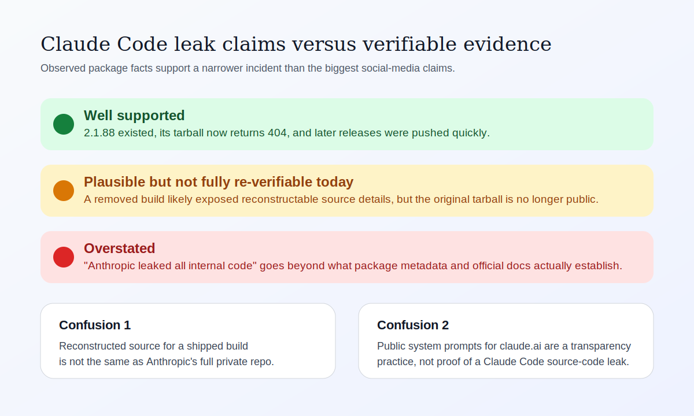
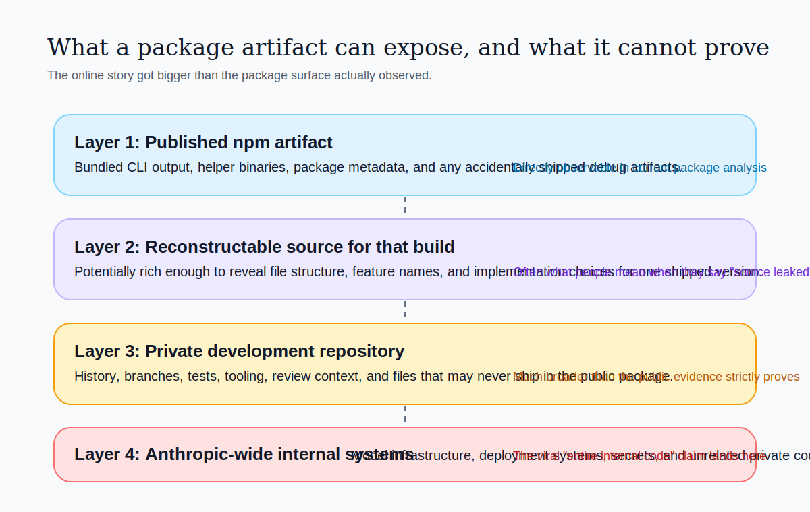
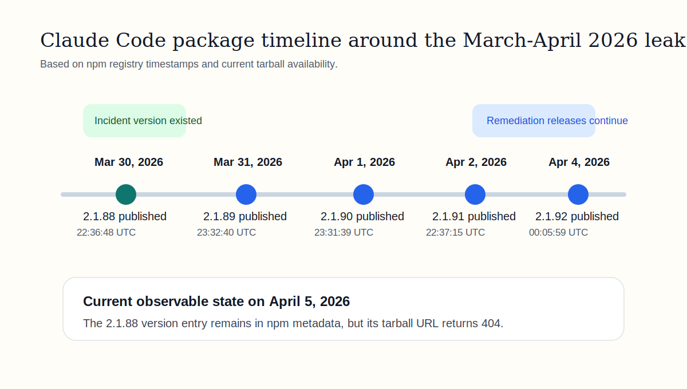
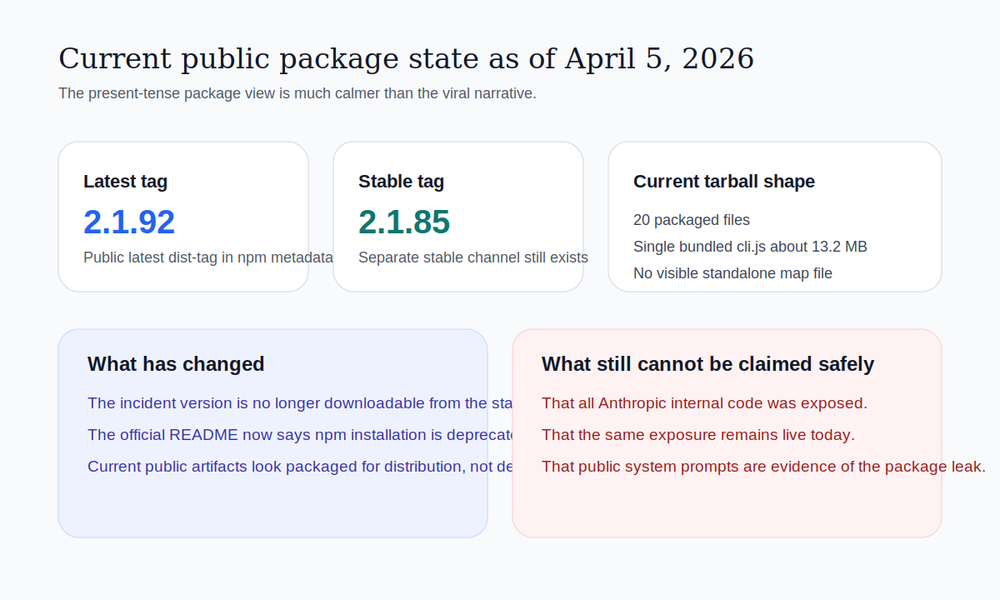

# Abstract

In the last week of March and the first days of April 2026, social posts and mirror repositories began claiming that Anthropic had "leaked the entire Claude Code source code," and in some versions of the story, even "all internal code." Those claims spread quickly because Claude Code sits at the intersection of AI tooling, agent systems, and developer infrastructure, which made the story feel larger than a routine package-distribution mistake.

This paper reviews what can actually be established from primary evidence available on April 5, 2026. The analysis relies on current npm registry metadata for `@anthropic-ai/claude-code`, the current official Claude Code README and changelog, the official Claude Code documentation site, and Anthropic's public system-prompt release-notes page. The result is a more precise conclusion than the social-media version. There is strong evidence that a specific npm-published build, `2.1.88`, existed and was subsequently removed from public tarball access. There is also strong evidence that the package was remediated quickly in later releases. What is **not** established by official public materials is the broad claim that Anthropic exposed its "entire internal codebase." The most defensible reading is narrower: a production package build appears to have been published in a way that enabled unusually deep reconstruction of that build, but that is not the same thing as leaking Anthropic's full internal repository, infrastructure, or model stack.

  

    <strong>Most defensible summary</strong>
    
This was a package-artifact exposure story, not verified proof that Anthropic published its whole private engineering estate.

  

  

    <strong>Best-supported fact</strong>
    
`2.1.88` was published on March 30, 2026, and its tarball now returns `404`, while later versions remain available.

  

  

    <strong>Most common confusion</strong>
    
People mixed together three different things: npm build artifacts, reconstructed source from a source map, and Anthropic's separately public system prompts.

  

  

    <strong>Current public state</strong>
    
As of April 5, 2026, the latest npm release is `2.1.92`, npm installation is deprecated in the official README, and the current tarball does not expose a visible `.map` file.

  

## 1. Why This Story Took Off

The story spread because it combined three ingredients that reliably amplify online security claims:

- a high-profile AI product
- a concrete version number
- screenshots and reposts framed as "proof of everything"

That combination often produces a familiar escalation pattern. A real technical mistake gets reported. The first summaries are imprecise. Then the most dramatic phrasing wins distribution. By the time the story reaches wider developer communities, the wording has shifted from "a build artifact exposed more than intended" to "the whole company got dumped on GitHub."

That shift matters, because response quality depends on using the right frame.

If the event was a full internal repository leak, the implications would include private infrastructure details, unpublished services, CI pipelines, internal review notes, operational secrets, and possibly code unrelated to the CLI product at all.

If the event was a package-build exposure, the implications are still serious, but narrower. In that case, the blast radius is mostly about the contents of one shipped CLI build and what a source map or similar artifact makes recoverable from that build.

## 2. What Can Be Verified From Official and Primary Sources

The following points are directly supported by primary or official public materials available on April 5, 2026.

### 2.1 The Package and Version Timeline Are Real

Current npm registry metadata for `@anthropic-ai/claude-code` shows:

- `2.1.88` was published on March 30, 2026 at `22:36:48.424Z`
- `2.1.89` followed on March 31, 2026 at `23:32:40.530Z`
- `2.1.90` followed on April 1, 2026 at `23:31:39.018Z`
- `2.1.91` followed on April 2, 2026 at `22:37:15.575Z`
- `2.1.92` followed on April 4, 2026 at `00:05:59.607Z`

That release cadence does not by itself prove the cause, but it does support the view that Anthropic was moving quickly across several consecutive package updates.

### 2.2 The `2.1.88` Tarball Is Not Publicly Retrievable Now

On April 5, 2026, the version entry for `2.1.88` is still present in npm registry metadata, but the tarball URL for that version returns `404 Not Found`.

That is an important detail because it tells us two things:

- the version existed and remains part of the public package history
- the exact artifact central to the leak story is no longer retrievable from the normal tarball URL

This makes some stronger social claims hard to re-verify today from first principles. It also means many people are now analyzing copies, mirrors, or reposts of a removed artifact rather than a still-live npm package.

### 2.3 The Current Package State Looks Remediated

The latest npm tag on April 5, 2026 is `2.1.92`, while the `stable` dist-tag is `2.1.85`. The current `2.1.92` tarball downloads normally and contains a compact set of packaged artifacts:

- `cli.js`
- `package.json`
- `README.md`
- `LICENSE.md`
- `sdk-tools.d.ts`
- bundled platform-specific helper binaries under `vendor/`

The current tarball file list is small, and the shipped CLI is a single bundled JavaScript file of about `13.2 MB`. In the current `2.1.92` package, there is no visible standalone `.map` file in the tarball and no trailing `sourceMappingURL` marker in the shipped `cli.js`.

That does **not** prove what `2.1.88` contained, because the incident artifact is gone. But it does show the current public package no longer exposes the obvious pattern people are discussing.

### 2.4 Anthropic's Official README Does Not Treat npm as the Preferred Path Anymore

Anthropic's official public README for Claude Code now states that npm installation is deprecated and points users toward install scripts, Homebrew, WinGet, and the broader Claude Code setup documentation.

That matters because it shows the public packaging and distribution surface is actively changing. It also reduces the chance that an old npm-specific artifact issue should be generalized into claims about the entire current Claude Code delivery model.

## 3. What Is Plausible But Not Fully Re-Verified Today

The most repeated claim is that a source map in `2.1.88` exposed a recoverable TypeScript view of the CLI. That claim is plausible and widely repeated, and it is consistent with the structure of the social discussion around the incident.

But on April 5, 2026, there is an important limitation:

- the `2.1.88` tarball is no longer available from the standard npm URL
- Anthropic does not appear to have published a public incident write-up or changelog entry explicitly describing the packaging mistake
- the current official Claude Code changelog for `2.1.89` through `2.1.92` does not mention a source-map leak directly

So the careful position is this:

- it is reasonable to treat the source-map story as the central public explanation for the incident
- it is **not** equally reasonable to present every viral embellishment around that explanation as verified fact

This distinction is exactly where much of the public confusion begins.

## 4. What People Got Wrong

The public conversation merged several different categories of exposure into one oversized claim.

### 4.1 "Entire Claude Code" Is Not the Same as "Entire Anthropic Internal Code"

Even in the strongest reading of the leak claim, the exposed object was a published Claude Code package build. A package build is not the same thing as a company's full private source estate.

A published CLI build, even when richly recoverable, is still narrower than:

- internal repositories unrelated to the CLI
- private service backends
- deployment automation
- secret management systems
- model training code
- inference infrastructure
- business systems
- internal design or security review material

The phrase "entire internal code" is therefore substantially broader than what the package evidence supports.

### 4.2 Reconstructed Source Is Not the Same as a Canonical Private Repository

If a source map made large parts of the build reconstructable, that is serious. But reconstructed source is not identical to the original development repository.

It may preserve a great deal:

- module names
- file paths
- TypeScript structure
- feature flags
- hidden or unfinished product ideas

But it may still omit or distort:

- repository history
- surrounding tooling
- comments and commit rationale
- excluded files
- test infrastructure
- build secrets
- operational context

The difference matters because "recoverable code for one shipped build" and "the whole internal repo" are not interchangeable statements.

### 4.3 Public System Prompts Were Folded Into the Same Story by Mistake

Anthropic already publishes system prompts for the Claude web and mobile experiences through an official page. That page explicitly concerns `claude.ai` and the mobile apps.

This created a second confusion channel. Some posters treated prompt transparency as if it were evidence of a leak. Others combined prompt disclosures with the npm artifact story and presented the result as one giant breach.

That is inaccurate. Public system-prompt release notes are a deliberate transparency practice. They are not evidence that Claude Code itself was "fully dumped," and they are not the same thing as a leaked build artifact.

### 4.4 Current Package Inspection Was Often Replaced by Old Screenshots

A lot of reposts continued to speak in the present tense long after the package state had changed. That makes the situation sound as though the vulnerable artifact is still sitting on npm for anyone to inspect.

As of April 5, 2026, that framing is outdated. The `2.1.88` tarball URL returns `404`, and the current `2.1.92` tarball does not expose an obvious map file.

## 5. What Was Actually at Risk

Using only what can be supported with reasonable confidence, the most defensible risk assessment is:

### 5.1 What Was Likely Exposed

- the structure of a shipped Claude Code CLI build
- internal naming and implementation patterns visible in that build
- product capabilities, hidden switches, or incomplete features that shipped more transparently than intended
- details about how the terminal agent was assembled, bundled, and distributed

### 5.2 What Was Not Proven Publicly

- exposure of Anthropic's entire internal repositories
- exposure of Claude model weights
- exposure of Anthropic's backend production systems
- exposure of secret stores or privileged credentials
- exposure of every private feature across the company

That does not mean the event was minor. A recoverable production build from a leading AI coding product is still meaningful. Competitors, researchers, and attackers can all learn from it. But seriousness should not be exaggerated into categories the evidence does not support.

## 6. Why the Current Package State Matters More Than the Viral Posts

By April 5, 2026, the most relevant public facts are not the screenshots circulating online, but the package state users and researchers can observe now:

| Question | Current answer |
| --- | --- |
| Did `2.1.88` exist? | Yes, according to npm registry metadata |
| Is the `2.1.88` tarball still available from npm? | No, it currently returns `404` |
| Did Anthropic keep shipping updates after it? | Yes, `2.1.89` through `2.1.92` followed quickly |
| Is npm still the preferred install path? | No, the official README marks npm install as deprecated |
| Does the current package visibly expose a `.map` file? | Not in the current `2.1.92` tarball |

These points are more durable than reposted claims because they can be checked directly from official sources.

## 7. A Clear Judgment: What Is Right, What Is Wrong, What Is Still Unknown

### 7.1 Right

- There was a real package event around `@anthropic-ai/claude-code@2.1.88`.
- The package history shows a concrete incident window and rapid follow-on releases.
- The central public concern about build-level exposure is credible enough to take seriously.
- The event likely revealed more implementation detail than Anthropic intended for a commercial CLI product.

### 7.2 Wrong or Overstated

- "Anthropic leaked all its internal code."
- "The entire company repository is still public on npm."
- "Public system prompts prove Claude Code itself was fully leaked."
- "Current Claude Code releases still expose the same issue."

### 7.3 Still Unknown From Official Public Materials

- the exact official root-cause wording Anthropic would use
- whether the packaging issue was a source-map inclusion, a broader artifact mistake, or both
- the exact full contents of the removed `2.1.88` tarball as hosted on npm at publication time
- whether Anthropic plans a public postmortem

## 8. Conclusion

The best evidence available on April 5, 2026 supports a narrower and more precise conclusion than the online rumor cycle does. Claude Code appears to have had a real package-distribution incident centered on version `2.1.88`, and the public package history shows that Anthropic responded by moving quickly through subsequent releases. The removed tarball and the remediated current package state strongly suggest that the social story was rooted in an actual artifact-level problem.

But the strongest viral claim, that people obtained "the entire internal code" or "all of Anthropic's code," goes beyond what official public evidence establishes. What can be defended is that a published Claude Code build may have been exposed in a form that made unusually rich reconstruction possible. That is serious. It is also materially smaller than "the whole internal repo."

The larger lesson is not only about Claude Code. It is about how modern software incidents are misread online. Source maps, build outputs, public prompts, mirrors, and private repositories are different things. Once they get collapsed into one headline, the conversation becomes louder but less accurate. Good incident analysis does the opposite. It separates the artifact from the rumor, the official record from the repost, and the verified blast radius from the imagined one.

## References

1. npm registry metadata for `@anthropic-ai/claude-code`, accessed April 5, 2026. https://registry.npmjs.org/@anthropic-ai/claude-code
2. npm tarball URL for `@anthropic-ai/claude-code@2.1.88`, observed returning `404 Not Found` on April 5, 2026. https://registry.npmjs.org/@anthropic-ai/claude-code/-/claude-code-2.1.88.tgz
3. npm tarball URL for `@anthropic-ai/claude-code@2.1.92`, accessed April 5, 2026. https://registry.npmjs.org/@anthropic-ai/claude-code/-/claude-code-2.1.92.tgz
4. Anthropic. "Claude Code" README, official GitHub repository, accessed April 5, 2026. https://github.com/anthropics/claude-code/blob/main/README.md
5. Anthropic. "Claude Code overview," accessed April 5, 2026. https://code.claude.com/docs/en/overview
6. Anthropic. "Changelog," accessed April 5, 2026. https://code.claude.com/docs/en/changelog
7. Anthropic. "System Prompts," accessed April 5, 2026. https://platform.claude.com/docs/en/release-notes/system-prompts
