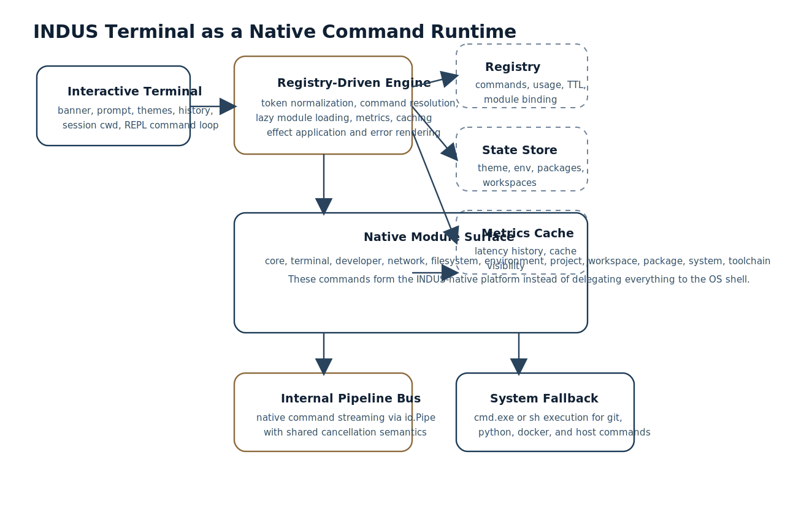
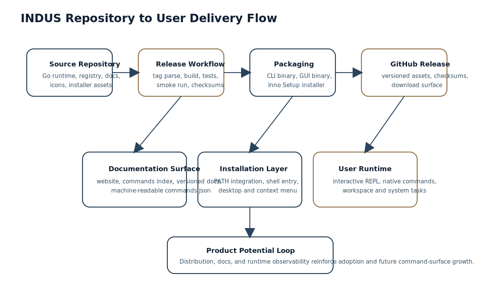

# Abstract

INDUS Terminal is a repository-centered software project that combines an interactive terminal, a registry-driven native command runtime, Windows-oriented installer and release packaging, and a documentation surface intended for end users and developers. Rather than treating the project as only a command-line shell, this paper studies INDUS as a software system with four coordinated layers: interactive experience, execution engine, command modules, and delivery pipeline.

The analysis in this paper is based on the public `hari7261/INDUS` repository as observed on March 30, 2026. At that point, the repository exposed a public website, versioned documentation, a registry version of `1.5.1`, `60` native commands across `11` modules, a Windows installer definition, and an automated release workflow that builds CLI and GUI binaries plus installer assets. The resulting picture is not of a single-purpose utility, but of a platform-oriented terminal product designed to unify command execution, workspace management, project scaffolding, package-like operations, network tooling, terminal state, and developer diagnostics inside one branded runtime.

This paper does not compare INDUS against other tools. Its goal is to document what the repository itself reveals about the product's architecture, product direction, and software potential.

## 1. Repository Profile

The INDUS repository is publicly described as a production-grade interactive terminal for API orchestration, developer tooling, and concurrent workloads. The repository metadata further shows a public documentation homepage and topical classification centered on CLI, terminal, Go, and the INDUS product identity.

As inspected on March 30, 2026, the repository exposed these observable characteristics:

| Dimension | Observed value |
| --- | --- |
| Repository | `hari7261/INDUS` |
| Visibility | Public |
| Default branch | `master` |
| GitHub homepage | `https://hari7261.github.io/INDUS/` |
| Latest public release observed | `v1.5.1` on March 8, 2026 |
| Registry version in source | `1.5.1` |
| Native command count | `60` |
| Module count | `11` |
| Implementation language | Go |
| Declared architectural posture | zero external runtime dependencies for the terminal core |

These facts matter because they show a project that is already organized as a product surface rather than a loose experimental codebase. INDUS includes release notes, build guides, versioned documentation, an installer script, release automation, icons, screenshots, and a structured command registry. That combination signals product intent.

## 2. System Framing

From the repository, INDUS can be understood as a branded native command runtime with an interactive shell front-end.

Its core behavior is built around three execution pathways:

1. native INDUS commands resolved from a registry
2. module execution through the engine
3. fallback execution of system commands through the host shell

This design is important because it avoids forcing the user into an either-or choice between a custom terminal and the underlying operating system. Instead, INDUS positions its own command surface as the primary experience while still preserving compatibility with ordinary system workflows.

## 3. Runtime Architecture

### 3.1 Bootstrap and Session Model

The entrypoint in [`cmd/indus-terminal/main.go`](https://github.com/hari7261/INDUS/blob/master/cmd/indus-terminal/main.go) shows that INDUS initializes console features, sets a terminal title, constructs an engine runtime, and then either:

- executes a command directly from command-line tokens, or
- enters an interactive terminal loop with a persistent session

The session carries current working directory and theme state. This matters because the runtime is not stateless command dispatch alone; it maintains terminal-local interaction state and applies effects such as theme changes, directory changes, and clear-screen operations.

### 3.2 Registry-Driven Execution

The engine implementation in [`internal/engine/engine.go`](https://github.com/hari7261/INDUS/blob/master/internal/engine/engine.go) loads command metadata from a registry file and resolves commands by path rather than by hardcoded switch statements spread across the entrypoint. Each command maps to a module, category, usage data, example, introduction version, and optional cache TTL.

This gives INDUS several important properties:

- command discovery can be documented consistently
- help text can be generated from the registry
- command metadata is centrally versioned
- caching behavior can be attached per command
- modules can be lazily loaded rather than initialized eagerly

### 3.3 Lazy Module Construction

The engine stores a factory map for module construction and only materializes modules on demand. This reduces startup complexity and makes the codebase more modular. From a product perspective, this is a useful foundation for continued command-surface growth because additional modules can be added without collapsing the runtime into one monolithic file.

### 3.4 Response Model and Effects

INDUS commands do not only return text output. The runtime also supports:

- warnings
- structured error rendering
- durations
- cache hits
- side effects such as changing theme or next directory

That effect model is visible in session updates performed by terminal-facing commands and workspace switching. It is a notable architectural choice because it treats the terminal as an application runtime, not merely a text printer.

## 4. Command Surface and Module Topology

The command registry in [`core/commands/registry.json`](https://github.com/hari7261/INDUS/blob/master/core/commands/registry.json) defines `60` native commands across `11` modules.

| Module | Commands |
| --- | ---: |
| `core` | 6 |
| `developer` | 6 |
| `environment` | 5 |
| `filesystem` | 6 |
| `network` | 6 |
| `package` | 6 |
| `project` | 6 |
| `system` | 5 |
| `terminal` | 6 |
| `toolchain` | 2 |
| `workspace` | 6 |

This balance is itself revealing. INDUS is not centered on one narrow function. Instead, the repository suggests a deliberate product map covering:

- runtime introspection
- developer diagnostics
- environment management
- filesystem operations
- local networking
- package-like catalog actions
- project lifecycle operations
- terminal presentation and speed metrics
- toolchain discovery
- workspace registration and archival

That breadth is one of the clearest indicators of platform potential in the project.

## 5. Native Command Bus and Shell Compatibility

One of the most consequential design choices in INDUS is the fallback path implemented in [`internal/engine/system_exec.go`](https://github.com/hari7261/INDUS/blob/master/internal/engine/system_exec.go). If a token sequence does not resolve to a native INDUS command, the engine attempts host-shell execution using `cmd.exe /C` on Windows and `sh -c` on Unix-like systems.

This has two implications.

First, INDUS can function as a branded front-end without isolating users from their existing tooling. Second, native command growth does not break compatibility with ordinary developer commands such as `git`, `python`, `docker`, or network diagnostics.

The software value here is not only convenience. It is workflow continuity. Users can remain in one terminal identity while mixing product-native operations and system-native operations.

## 6. Internal Workflow Model

### 6.1 Native Pipelines

The pipeline engine in [`internal/cli/pipeline.go`](https://github.com/hari7261/INDUS/blob/master/internal/cli/pipeline.go) implements internal command chaining with `io.Pipe`. The code explicitly avoids OS subprocess pipelines for supported INDUS commands and instead connects stages through in-process streams under a shared cancellable context.

This is important because it gives INDUS a stronger claim to being an execution runtime rather than only a shell skin. Internal pipelines allow:

- shared cancellation semantics
- structured streaming between commands
- avoidance of shell-level intermediary processes for native segments
- cleaner composition between INDUS-built commands

### 6.2 Metrics and Cache Visibility

The runtime tracks recent execution metrics and cache hits in memory, which terminal commands can surface. This gives INDUS an introspective quality that many small terminals do not attempt. The presence of `term speed`, `dev bench`, `dev cache`, and `dev report` indicates that the repository treats runtime observability as a first-class product capability.

## 7. Functional Capability Areas

### 7.1 Terminal Experience

The terminal layer exposes:

- ANSI-branded banner and prompt
- theme switching
- history display
- speed metrics
- reset and doctor operations

These capabilities are defined partly in the terminal module and partly in the main interactive loop. Their importance is not cosmetic alone. Together they create a recognizable product identity and a persistent user experience.

### 7.2 Project and Workspace Operations

The workspace and project modules show that INDUS is designed not just to run commands, but to organize development contexts. The code supports:

- project scaffold creation
- project initialization
- project build artifact emission
- project simulation runs
- workspace registration
- workspace switching with session effects
- workspace pinning
- workspace archival and cleaning

The combination of these features implies a product direction closer to a development environment surface than to a minimal terminal wrapper.

### 7.3 Developer Diagnostics

The developer module contributes a second layer of product maturity. Commands for benchmarking, cache inspection, runtime reload, report generation, and file-watch polling indicate that the project is designed to be inspectable and operable by advanced users, not only by end users.

### 7.4 Toolchain Detection

The toolchain module in [`internal/engine/module_toolchain.go`](https://github.com/hari7261/INDUS/blob/master/internal/engine/module_toolchain.go) scans for programming languages, package managers, build tools, version control tools, and container tooling concurrently. The implementation checks for installation and extracts version strings where available.

This feature expands INDUS from a command host into an environment-readiness surface. In onboarding, support, diagnostics, and machine setup flows, this is valuable because the terminal can immediately characterize the surrounding development machine.

### 7.5 Network and HTTP Operations

The network module in [`internal/engine/module_network.go`](https://github.com/hari7261/INDUS/blob/master/internal/engine/module_network.go) shows a cohesive local-network and HTTP utility set:

- URL fetch
- reachability probes
- local port scan
- host trace
- outbound readiness check
- network interface and lookup reporting

This strengthens the project’s identity as a developer workflow terminal rather than a pure text shell.

## 8. Delivery and Distribution Strategy

The repository demonstrates a mature Windows-first delivery path.

### 8.1 Installer Design

The Inno Setup script in [`installer/indus-setup.iss`](https://github.com/hari7261/INDUS/blob/master/installer/indus-setup.iss) defines:

- installation under local app data
- optional PATH integration
- desktop and Start Menu shortcuts
- right-click “Open INDUS Terminal here” shell integration
- uninstall registration
- user-level install posture

This is a productization milestone, not a minor accessory. It means the repository is structured for software adoption beyond source-code cloning.

### 8.2 Release Automation

The GitHub Actions workflow in [`.github/workflows/release.yml`](https://github.com/hari7261/INDUS/blob/master/.github/workflows/release.yml) automates:

- tag-driven version parsing
- Go setup
- icon embedding
- binary builds
- test execution
- smoke testing
- installer creation
- checksum generation
- release asset publication

This indicates that INDUS is already organized for repeatable shipping rather than ad hoc manual packaging.

### 8.3 Versioned Documentation Surface

The repository includes a published docs site with pages such as:

- [`docs/index.html`](https://github.com/hari7261/INDUS/blob/master/docs/index.html)
- [`docs/commands.html`](https://github.com/hari7261/INDUS/blob/master/docs/commands.html)
- [`docs/versions.html`](https://github.com/hari7261/INDUS/blob/master/docs/versions.html)
- [`docs/commands.json`](https://github.com/hari7261/INDUS/blob/master/docs/commands.json)

This matters because discoverability and upgrade clarity are part of the product surface, not only the codebase.

## 9. Product Potential

The repository suggests at least five strong product directions for INDUS.

| Direction | Why the repository supports it |
| --- | --- |
| Branded developer terminal | Interactive shell, prompt themes, session effects, installer, icons, docs site |
| Native command platform | Registry-backed command bus, modular architecture, command metadata, generated help |
| Environment readiness tool | Toolchain detection, diagnostics, doctor commands, reports |
| Project and workspace orchestrator | Project manifests, workspace state, archive and switch flows |
| Operable desktop-distributed software | Installer, smoke tests, checksums, release automation, versioned docs |

The most important point is that these directions are not speculative fantasies disconnected from the repository. Each one is already reflected in implementation or packaging artifacts.

## 10. Design Strengths Visible in the Repository

Several design strengths stand out.

### 10.1 Cohesive Product Identity

INDUS is not presented as a generic unnamed CLI. The repository, installer, docs, terminal banner, shell integration, and release assets all reinforce one product identity.

### 10.2 Structured Growth Model

Because commands are registry-backed and module-based, the codebase has a clear path for feature expansion without rewriting the entry architecture.

### 10.3 Operability

Benchmarks, cache inspection, reloads, reports, diagnostics, and status commands all point toward a tool that can explain itself while it runs.

### 10.4 Distribution Readiness

The release workflow, checksums, installer packaging, and public release cadence make INDUS easier to adopt as software rather than only as source code.

## 11. Constraints and Open Engineering Questions

A repository-based study should also acknowledge questions that remain open from the current materials.

- The project appears Windows-first in product polish, even though parts of the runtime include Unix-aware execution branches.
- Some top-level documentation still reflects earlier command naming and feature counts, while the registry and engine show a more advanced native command surface.
- The long-term package model appears intentionally lightweight and internal rather than tied to an external package ecosystem.
- Interactive history and completion claims in documentation would benefit from tighter synchronization with the runtime implementation over time.

These are not negative judgments. They are normal signs of a product evolving rapidly.

## 12. Conclusion

The INDUS repository reveals a software project with significantly more structure than a simple terminal utility. It contains a native command engine, lazy-loaded module system, session-aware interactive shell, internal streaming pipeline mechanism, environment and workspace state, network and project tooling, Windows installer packaging, automated release shipping, and versioned public documentation. Taken together, these elements position INDUS as a platform-oriented developer terminal product with a distinct identity and credible operational depth.

The strongest takeaway from the repository is not any single command. It is the coherence of the system: runtime, command surface, state model, documentation, and delivery pipeline all move in the same direction. That coherence is the clearest indicator of INDUS’s software potential.

## References

1. Hariom Kumar Pandit. "INDUS." GitHub repository. Accessed March 30, 2026. https://github.com/hari7261/INDUS
2. Hariom Kumar Pandit. "README.md." INDUS repository. Accessed March 30, 2026. https://github.com/hari7261/INDUS/blob/master/README.md
3. Hariom Kumar Pandit. "CAPABILITIES.md." INDUS repository. Accessed March 30, 2026. https://github.com/hari7261/INDUS/blob/master/CAPABILITIES.md
4. Hariom Kumar Pandit. "cmd/indus-terminal/main.go." INDUS repository. Accessed March 30, 2026. https://github.com/hari7261/INDUS/blob/master/cmd/indus-terminal/main.go
5. Hariom Kumar Pandit. "internal/engine/engine.go." INDUS repository. Accessed March 30, 2026. https://github.com/hari7261/INDUS/blob/master/internal/engine/engine.go
6. Hariom Kumar Pandit. "internal/cli/pipeline.go." INDUS repository. Accessed March 30, 2026. https://github.com/hari7261/INDUS/blob/master/internal/cli/pipeline.go
7. Hariom Kumar Pandit. "core/commands/registry.json." INDUS repository. Accessed March 30, 2026. https://github.com/hari7261/INDUS/blob/master/core/commands/registry.json
8. Hariom Kumar Pandit. "internal/engine/system_exec.go." INDUS repository. Accessed March 30, 2026. https://github.com/hari7261/INDUS/blob/master/internal/engine/system_exec.go
9. Hariom Kumar Pandit. "internal/engine/module_toolchain.go." INDUS repository. Accessed March 30, 2026. https://github.com/hari7261/INDUS/blob/master/internal/engine/module_toolchain.go
10. Hariom Kumar Pandit. "internal/engine/module_project.go." INDUS repository. Accessed March 30, 2026. https://github.com/hari7261/INDUS/blob/master/internal/engine/module_project.go
11. Hariom Kumar Pandit. "internal/engine/module_workspace.go." INDUS repository. Accessed March 30, 2026. https://github.com/hari7261/INDUS/blob/master/internal/engine/module_workspace.go
12. Hariom Kumar Pandit. "internal/engine/module_network.go." INDUS repository. Accessed March 30, 2026. https://github.com/hari7261/INDUS/blob/master/internal/engine/module_network.go
13. Hariom Kumar Pandit. "installer/indus-setup.iss." INDUS repository. Accessed March 30, 2026. https://github.com/hari7261/INDUS/blob/master/installer/indus-setup.iss
14. Hariom Kumar Pandit. "release.yml." INDUS repository workflow. Accessed March 30, 2026. https://github.com/hari7261/INDUS/blob/master/.github/workflows/release.yml
15. Hariom Kumar Pandit. "INDUS Terminal v1.5.1." GitHub release, March 8, 2026. https://github.com/hari7261/INDUS/releases/tag/v1.5.1
