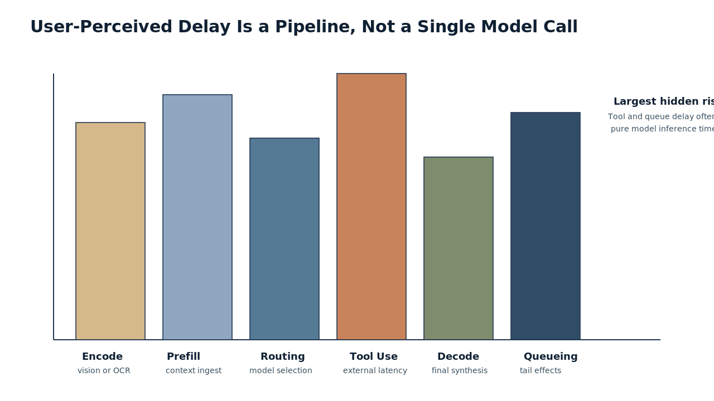
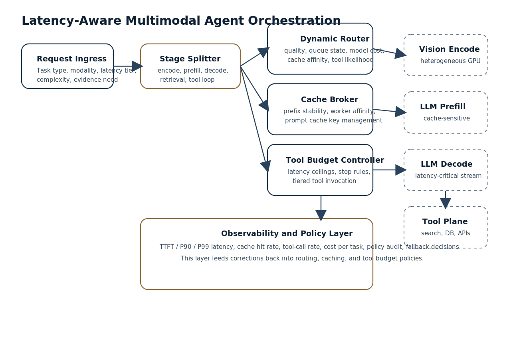

# Abstract

Latency is the central systems problem in multimodal agents. Once an application combines image encoding, text reasoning, retrieval, function calling, and downstream APIs, user-perceived delay becomes the sum of several heterogeneous stages rather than the cost of a single model call. Recent serving work shows that multimodal requests suffer from stage imbalance, head-of-line blocking, and poor resource utilization when vision encoding, language prefill, and decode are scheduled as one monolithic unit. Recent agentic inference work further shows that tool calls often dominate first-token latency and that decoupled orchestration layers destroy cache locality across iterative calls.

This paper synthesizes current research and vendor guidance into a practical design for latency-aware multimodal agent orchestration. The central argument is that low-latency multimodal agents require four decisions to be made jointly rather than independently: stage-aware multimodal scheduling, dynamic model routing, prefix-aware cache placement, and budgeted tool calling. The literature now contains strong partial solutions for each layer, but there is still no widely adopted unified stack that optimizes all four at once. The proposed architecture in this paper is intended as a production design pattern rather than a benchmark claim from this repository.

**Keywords:** multimodal agents, latency optimization, heterogeneous inference, dynamic routing, prompt caching, tool orchestration

## 1. Problem Statement

The current generation of multimodal agents is expected to interpret images, read context, reason over text, decide whether external tools are necessary, call those tools, and then synthesize a final answer. In practice, this pipeline is frequently too slow for interactive use.

The difficulty is structural:

- multimodal requests contain different computational stages with very different resource profiles
- model routing choices affect both quality and queueing delay
- cache hits depend on prompt stability and server locality rather than model quality alone
- tool calls add network delay, serialization overhead, and orchestration stalls

For a user, only end-to-end delay matters. For the system designer, however, that delay is the result of a chain:

`T_total = T_encode + T_prefill + T_decode + T_route + T_tool + T_retrieval + T_queue + T_postprocess`

A latency-aware orchestration layer therefore cannot optimize only one term. It must decide when to use a faster model, when to reuse a cache, when to skip or defer a tool, and when to separate multimodal stages onto different resources.

## 2. Why Existing Multimodal Agents Feel Slow

Recent research isolates several recurring causes of delay.

| Source of delay | Why it happens | Practical consequence |
| --- | --- | --- |
| Vision-language stage coupling | Image encode, prefill, and decode have different memory and compute needs, yet many systems schedule them together | Low utilization and inflated request latency |
| Head-of-line blocking | Large image or video requests monopolize shared queues | Short text or small-image requests wait behind heavy jobs |
| Router blindness | Static model selection ignores instantaneous queue state, cache locality, or latency budget | A high-quality choice can still be the wrong runtime choice |
| Cache fragmentation | Repeated prompts land on different workers or have unstable prefixes | KV reuse collapses even when semantic reuse exists |
| Tool overuse | Agents call tools for information that could be answered from local context or retrieved memory | External latency dominates response time |
| Sequential orchestration | Tool execution and later model work are handled strictly step by step | Parallelism opportunities are lost |

HydraInfer argues that multimodal inference should not be treated like text-only serving with an image encoder attached; its encode, prefill, and decode stages should be scheduled separately across heterogeneous instances when service objectives demand it. RPS-Serve makes the complementary point that modality itself changes queue behavior: large multimodal jobs create blocking patterns that resemble oversized packets in a shared network, so the scheduler has to become modality-aware rather than merely throughput-aware. DistServe, although focused on text LLM serving, shows why separating prefill from decode can improve goodput under latency constraints; that insight transfers directly to multimodal agent backbones.

## 3. Related Work and Evidence Base

This article draws on three evidence streams: model-serving systems, routing systems, and agentic tool-execution systems.

| Area | Representative source | Key observation used here |
| --- | --- | --- |
| Multimodal serving | HydraInfer (2025) | Stage-level disaggregation reduces latency and improves throughput under multimodal workloads |
| Modality-aware scheduling | RPS-Serve (2026) | Small interactive requests should not be trapped behind heavy visual requests |
| Prefill/decode disaggregation | DistServe (2024) | Separating stages can substantially improve SLO attainment |
| Routing across models | MixLLM (2025), FrugalGPT (2023), RouteLLM (2024) | Query-level routing can trade off quality, cost, and latency rather than hardcoding one model |
| Cache reuse | vLLM Automatic Prefix Caching, OpenAI Prompt Caching | Prefix reuse is real, but only when prompts are stable and routed to compatible execution state |
| Tool-intercept serving | InferCept (2024) | Tool-augmented inference wastes time if each intercept forces redundant recomputation |
| Agentic orchestration co-design | Sutradhara (2026) | Tool execution, prompt splitting, and cache management should be integrated with the serving engine |

Two findings are especially important for this topic.

First, the serving literature now clearly shows that stage separation matters. HydraInfer reports up to 4x higher multimodal throughput than vLLM under its evaluated workloads while meeting a 90th percentile request SLO. DistServe reports that prefill/decode disaggregation can serve substantially more requests under latency constraints. These are not generic optimization tips; they imply that a multimodal agent router should understand which stage is becoming the bottleneck before it chooses a model or dispatches a tool.

Second, the agentic inference literature shows that tool use is itself a latency system. InferCept reports that external interactions in augmented LLM inference can trigger redundant recomputation. Sutradhara reports that tool calls can consume 30-80% of first-token-rendered latency and that sequential orchestration wastes intra-request parallelism. This means that better tool use is not only a reasoning problem; it is a scheduling and cache-management problem.

## 4. Design Requirements for a Better Orchestrator

Any serious orchestration system for this workload should satisfy five requirements.

### 4.1 Stage Awareness

The orchestrator must distinguish at least these stages:

1. multimodal encode
2. language prefill
3. iterative decode
4. retrieval and memory lookup
5. tool execution and reintegration

Collapsing these stages into one routing decision hides the true bottleneck.

### 4.2 Budget Awareness

The orchestrator should maintain explicit budgets for:

- wall-clock latency
- model cost
- tool-call count
- external API timeout
- evidence confidence threshold

Without budgets, tool use tends to expand until it dominates the interaction.

### 4.3 Cache Awareness

The system should preserve identical or near-identical prompt prefixes, tool schemas, and reusable system instructions. OpenAI's prompt caching guidance explicitly notes that exact prefix matches, including identical images and tools, are required for cache hits. vLLM's automatic prefix caching makes the same point at the engine layer. Therefore, the orchestration layer has to be written in a cache-friendly way, not merely deployed on a cache-capable backend.

### 4.4 Heterogeneous Routing

Different requests should not be forced through one general-purpose multimodal model. Simple visual classification, OCR-heavy extraction, policy lookup, and long-form synthesis rarely require the same routing policy.

### 4.5 Graceful Degradation

When the latency budget is nearly exhausted, the system should degrade predictably:

- reduce candidate models
- stop speculative tool exploration
- shrink output length
- fall back to text-only reasoning if visual evidence is already encoded
- return a partial answer with explicit uncertainty if required

## 5. Proposed Architecture

The proposed architecture is a layered orchestrator that sits above the serving plane but exchanges runtime hints with it rather than treating the engine as a black box.

### 5.1 Request Ingress

The request is normalized into a structured envelope:

- task type
- modalities present
- estimated complexity
- user latency tier
- maximum tool budget
- cache key candidates

This is the only point where request classification should be expensive. Everything downstream should use compact metadata.

### 5.2 Stage Splitter

If the request includes images or video, the orchestrator separates visual encoding from text planning. This follows the same intuition as HydraInfer: multimodal encode does not need to be pinned to the same schedule as decode.

### 5.3 Router

The router selects among candidate models using a multi-objective score:

- expected answer quality
- expected queueing delay
- expected cache hit probability
- expected tool usage downstream
- marginal cost

This is where the literature on FrugalGPT, RouteLLM, and MixLLM becomes useful. Their core lesson is that routing should be contextual and continuously updated rather than static.

### 5.4 Cache Broker

The cache broker maintains stable prompt prefixes, assigns `prompt_cache_key` values where the backend supports them, and prefers workers with recent matching prefixes when possible. The point is not just to enable caching but to avoid routing decisions that accidentally destroy cache locality.

### 5.5 Tool Budget Controller

The controller decides among four options:

1. no tool call
2. cached tool result
3. single direct tool call
4. multi-tool plan with strict stopping criteria

Each action must consume from an explicit latency budget rather than an implicit hope that the tool will be fast enough.

## 6. Dynamic Routing Strategy

Dynamic routing in this setting should be treated as a constrained decision problem, not a generic classifier.

| Signal | Why it matters |
| --- | --- |
| Modality mix | Image and video requests produce different stage costs than text-only requests |
| Queue state | The best model in isolation may be the worst model under congestion |
| Cache locality | A slightly weaker model with a hot prefix can beat a stronger cold model on end-to-end latency |
| Tool likelihood | Requests likely to trigger retrieval or APIs should reserve budget before model selection |
| Output length estimate | Decode-heavy tasks need different choices than short extraction tasks |

MixLLM is especially relevant because it frames routing as a dynamic tradeoff among quality, cost, and latency, and reports strong tradeoff performance under time constraints. That result should not be copied mechanically to multimodal agents, but it supports the architectural choice to make routing policy context-sensitive and continually adaptable.

## 7. Cache Strategy

Cache strategy has to be designed at three levels.

### 7.1 Prefix Stability

Place the most stable instructions first, variable user content later, and keep tool definitions identical whenever possible. This follows OpenAI's prompt caching guidance directly and also improves compatibility with engine-level prefix caching.

### 7.2 Cross-Step Reuse

InferCept and Sutradhara both highlight a common failure mode in agentic systems: after a tool intercept, the next call often recomputes context that the system already had. The orchestrator should preserve reusable intermediate state across tool boundaries instead of serializing each step into a totally new request.

### 7.3 Worker Affinity

Even a perfect prefix is useless if requests are routed away from the worker holding the relevant cache state. For that reason, latency-aware routing should include cache affinity as a first-class objective rather than a backend implementation detail.

## 8. Budgeted Tool Calling

Tool calling should be governed by an explicit policy, not by unconstrained model preference.

### 8.1 Decision Rule

A tool should be called only if the expected utility exceeds the combined cost of:

- added latency
- added failure risk
- serialization overhead
- cache disruption
- downstream synthesis time

### 8.2 Tool Tiers

| Tier | Example | Default policy |
| --- | --- | --- |
| Tier 0 | local memory or cached retrieval result | use freely |
| Tier 1 | fast deterministic API lookup | use if confidence gain is material |
| Tier 2 | slower search, browser, or database action | require unmet evidence need |
| Tier 3 | multi-step external workflow | require explicit budget and stopping rule |

### 8.3 Early Exit Conditions

The orchestration loop should stop tool use when:

- the marginal evidence gain is below a threshold
- the latency budget is nearly consumed
- two consecutive tools return redundant evidence
- the answer can be completed with bounded uncertainty

This is where many agent stacks still underperform in production. They optimize correctness heuristics but lack hard stop conditions for latency control.

## 9. Recommended Evaluation Protocol

A serious evaluation should report more than average latency.

| Metric | Why it is required |
| --- | --- |
| TTFT or FTR | Captures user-perceived responsiveness |
| End-to-end latency | Captures full completion cost |
| P90 and P99 latency | Tail behavior matters for interactive systems |
| Tool-call rate | Measures whether the agent is overusing tools |
| Cache hit rate | Reveals whether orchestration preserves reusable prefixes |
| Cost per successful task | Prevents fast but wasteful optimization |
| Quality under budget | Measures whether latency reductions harm task success |

Workloads should be split by request class:

- text only
- text plus one image
- OCR-heavy document image
- large image set
- video or long visual sequence
- retrieval-rich tool-assisted task

Without workload segmentation, latency claims are difficult to trust because small text jobs can hide failures on heavy multimodal requests.

## 10. Practical Implementation Guidance

For a production system built today, the strongest design pattern is:

1. classify the request early
2. separate multimodal encode from text planning where the stack permits it
3. route using a multi-objective score that includes queue state and cache affinity
4. keep prompts and tool schemas prefix-stable
5. treat tool calls as budgeted actions
6. preserve intermediate state across tool intercepts
7. measure TTFT, end-to-end delay, tool rate, and cache hit rate together

This is a synthesis from the cited literature and vendor guidance rather than a claim that one framework currently solves the whole stack out of the box.

## 11. Limitations and Open Questions

Several hard problems remain open.

- Most routing literature is still text-centric and does not fully internalize multimodal stage imbalance.
- Cache systems are usually backend-local, while agent frameworks often make routing decisions without visibility into cache state.
- Tool budgets are rarely learned from real utility curves; many systems still rely on heuristics.
- Multimodal benchmarks often report throughput or average latency without enough tail-latency detail for interactive use cases.
- Cross-provider routing is operationally attractive but difficult when capabilities, tokenization, and cache semantics differ.

The open research gap is therefore not how to make a model faster in isolation. It is how to jointly optimize routing, caching, and tool use when multimodal stages have heterogeneous latency behavior.

## 12. Conclusion

The evidence now supports a clear conclusion: multimodal agent latency is primarily an orchestration problem. Better base models help, but the decisive gains come from stage-aware scheduling, contextual routing, cache-preserving request design, and tool-use policies that respect strict latency budgets. Systems such as HydraInfer, DistServe, InferCept, and Sutradhara demonstrate that substantial latency reduction is possible when the orchestration layer and serving layer are designed together. What remains missing in most production stacks is a unified controller that makes those decisions jointly for multimodal, tool-augmented workloads.

## References

1. Xianzhe Dong, Tongxuan Liu, Yuting Zeng, Liangyu Liu, Yang Liu, Siyu Wu, Yu Wu, Hailong Yang, Ke Zhang, and Jing Li. "HydraInfer: Hybrid Disaggregated Scheduling for Multimodal Large Language Model Serving." arXiv, 2025. https://arxiv.org/abs/2505.12658
2. Konstantinos Papaioannou and Thaleia Dimitra Doudali. "Rocks, Pebbles and Sand: Modality-aware Scheduling for Multimodal Large Language Model Inference." arXiv, 2026. https://arxiv.org/abs/2603.26498
3. Yinmin Zhong, Shengyu Hao, Weitian Wang, Yilong Lv, Yujie Wang, Dacheng Li, Xingda Wei, Zhenheng Tang, Xiaoxuan Jiang, Jiarui Fang, Yibo Zhu, Haibo Chen, and Xin Jin. "DistServe: Disaggregating Prefill and Decoding for Goodput-optimized Large Language Model Serving." arXiv, 2024. https://arxiv.org/abs/2401.09670
4. Xinyuan Wang, Yanchi Liu, Wei Cheng, Xujiang Zhao, Zhengzhang Chen, Wenchao Yu, Yanjie Fu, and Haifeng Chen. "MixLLM: Dynamic Routing in Mixed Large Language Models." NAACL, 2025. https://aclanthology.org/2025.naacl-long.545/
5. Lingjiao Chen, Matei Zaharia, and James Zou. "FrugalGPT: How to Use Large Language Models While Reducing Cost and Improving Performance." arXiv, 2023. https://arxiv.org/abs/2305.05176
6. Isaac Ong, Amjad Almahairi, Vincent Wu, Wei-Lin Chiang, Tianhao Wu, Joseph E. Gonzalez, M Waleed Kadous, and Ion Stoica. "RouteLLM: Learning to Route LLMs with Preference Data." arXiv, 2024. https://arxiv.org/abs/2406.18665
7. Reyna Abhyankar, Zijian He, Vikranth Srivatsa, Hao Zhang, and Yiying Zhang. "InferCept: Efficient Intercept Support for Augmented Large Language Model Inference." ICML, 2024. https://proceedings.mlr.press/v235/abhyankar24a.html
8. Anish Biswas, Kanishk Goel, Jayashree Mohan, Alind Khare, Anjaly Parayil, Ramachandran Ramjee, and Chetan Bansal. "Sutradhara: An Intelligent Orchestrator-Engine Co-design for Tool-based Agentic Inference." arXiv, 2026. https://arxiv.org/abs/2601.12967
9. OpenAI. "Prompt caching." OpenAI API Documentation. Accessed March 30, 2026. https://platform.openai.com/docs/guides/prompt-caching
10. OpenAI. "Latency optimization." OpenAI API Documentation. Accessed March 30, 2026. https://platform.openai.com/docs/guides/latency-optimization
11. vLLM Project. "Automatic Prefix Caching." vLLM Documentation. Accessed March 30, 2026. https://docs.vllm.ai/usage/automatic_prefix_caching.html
