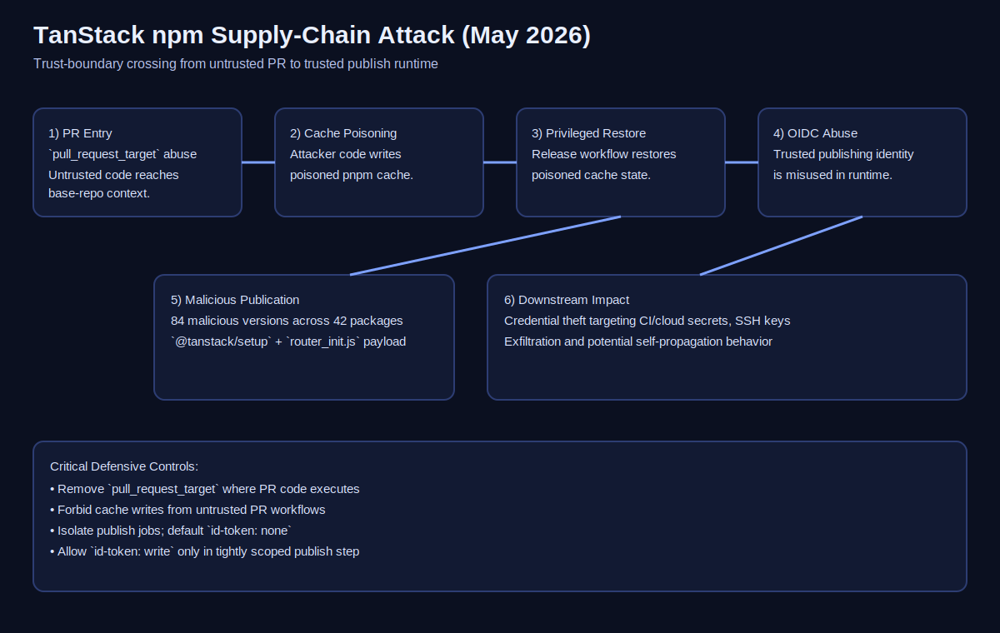

# TanStack npm Supply-Chain Attack 2026 — Incident Report

## Executive Summary

On **May 11, 2026**, attackers compromised TanStack Router/Start release flow and published **84 malicious versions across 42 packages**. Public reporting indicates rapid detection, staged deprecation, and an all-clear by **May 15, 2026**.

This was not a simple npm-token theft scenario. The attack chain crossed CI trust boundaries:

1. `pull_request_target` workflow abuse
2. GitHub Actions cache poisoning
3. OIDC token/runtime identity misuse
4. npm trusted-publishing abuse
5. Malicious release publication with valid-looking provenance



## What Happened

A malicious PR from a disguised fork triggered `pull_request_target` workflows in base-repository context. Attacker-controlled execution poisoned the pnpm cache. Later, a legitimate release workflow restored that cache, executed malicious logic in privileged context, and enabled malicious package publishing.

## Scope and Affected Area

| Area | Status |
| --- | --- |
| Affected repo family | Router/Start |
| Affected namespace | `@tanstack/*` (Router/Start-related) |
| Affected packages | 42 |
| Affected versions | 84 |
| Current package state | TanStack declared current publishes safe on May 15, 2026 |

## Timeline (UTC)

| Time | Event |
| ---: | --- |
| May 10 17:16 | Renamed attacker fork created |
| May 10 23:29 | Malicious commit added with `[skip ci]` |
| May 11 ~10:49 | PR opened against `TanStack/router` |
| May 11 10:49–11:11 | `pull_request_target` execution window |
| May 11 11:29 | Poisoned cache saved |
| May 11 19:15–19:16 | Release workflow restores poisoned cache |
| May 11 19:20 / 19:26 | Two malicious publish batches |
| May 11 19:46 | External public disclosure |
| May 11 20:19–21:03 | TanStack deprecates affected versions |
| May 15 | TanStack all-clear and hardening follow-up |

## Malware Behavior

Malicious versions added:

```json
"optionalDependencies": {
  "@tanstack/setup": "github:tanstack/router#79ac49eedf774dd4b0cfa308722bc463cfe5885c"
}
```

Install flow resolved and executed obfuscated payloads (`router_init.js`), targeting credentials/secrets from CI and cloud contexts, with reported exfiltration and potential self-propagation behavior.

## Key IOCs

- `@tanstack/setup`
- `79ac49eedf774dd4b0cfa308722bc463cfe5885c`
- `router_init.js` (~2.3 MB)
- `Linux-pnpm-store-6f9233a50def742c09fde54f56553d6b449a535adf87d4083690539f49ae4da11`
- `filev2.getsession.org`, `seed1.getsession.org`, `seed2.getsession.org`, `seed3.getsession.org`
- `litter.catbox.moe`

## Root Cause Analysis

| Layer | Failure |
| --- | --- |
| Trigger model | Unsafe privilege with `pull_request_target` |
| Cache boundary | Untrusted workflow poisoned trusted cache |
| Release isolation | Privileged job consumed untrusted cache |
| Trusted publishing | Runtime path allowed publish-capable identity misuse |
| Monitoring | External detection preceded internal detection |

## Immediate Remediation Checklist

1. Treat hosts/runners that installed affected versions on **May 11, 2026** as compromised.
2. Hunt lockfiles, caches, and artifacts for known IOCs.
3. Rotate all reachable credentials (GitHub, npm, cloud, Vault, SSH, CI secrets, signing assets).
4. Purge CI/package caches and rebuild from clean runners.
5. Block and monitor known exfiltration domains.

## Engineering Hardening Recommendations

1. Remove `pull_request_target` where PR code can execute.
2. Disable cache writes from untrusted PR contexts.
3. Pin Actions by immutable commit SHA.
4. Isolate publish job from cache-restore and untrusted artifacts.
5. Default workflow permissions to:

```yaml
permissions:
  contents: read
  id-token: none
```

Publish-only exception:

```yaml
permissions:
  contents: read
  id-token: write
```

6. Use install hardening where possible:

```bash
npm ci --ignore-scripts
pnpm install --ignore-scripts --frozen-lockfile
yarn install --ignore-scripts --immutable
```

## References

1. https://tanstack.com/blog/npm-supply-chain-compromise-postmortem
2. https://tanstack.com/blog/incident-followup
3. https://digital.nhs.uk/cyber-alerts/2026/cc-4781
4. https://www.aikido.dev/blog/mini-shai-hulud-is-back-tanstack-compromised
5. https://socket.dev/blog/tanstack-npm-packages-compromised-mini-shai-hulud-supply-chain-attack
6. https://openai.com/index/our-response-to-the-tanstack-npm-supply-chain-attack/
